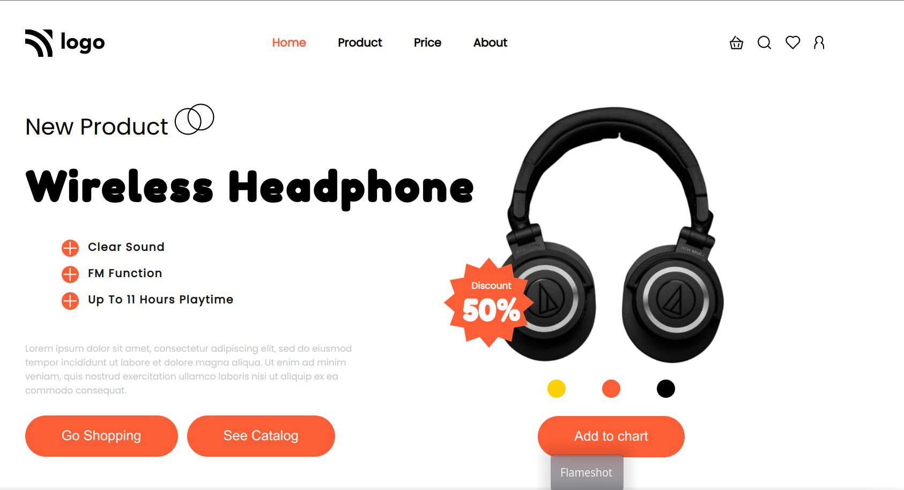

# Go-Wireless-Headphone

# Go Wireless Headphone

> Project 7

<table>
<tr>
<td>
  A landing page designed using pure HTML & CSS.
</td>
</tr>
</table>

### Skills Gained from this

- Applied all the knowledge of positions, flex, hover, etc.., and completed this.

### Screenshot

## Device support

The site is compatible with desktop/laptop screens only.

## Author

